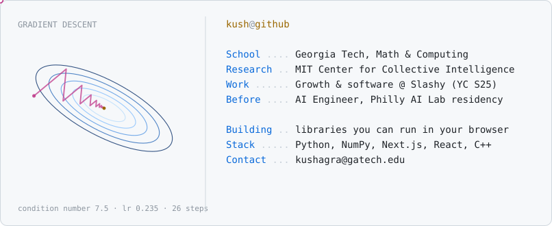

<!-- The panel is a real gradient-descent run on an ill-conditioned quadratic:
     the contours are true level sets, the zig-zag is what a fixed learning
     rate actually does. Regenerate with `python3 make_panel.py`. -->

<picture>
  <source media="(prefers-color-scheme: dark)" srcset="gd-dark.svg">
  
</picture>

Hi! My main interests are ML, startups and finance, and I'm studying Math &
Computing at Georgia Tech.

Most of this account is numerical libraries written from scratch in Python.
Three of them run in your browser.

## Run them in your browser

No install and no clone. Each page compiles the Python package to WebAssembly
and runs it in your tab, so the numbers are computed while you read them.

**[transformer-from-scratch](https://superkush06.github.io/transformer-from-scratch/demo/)** &nbsp;·&nbsp; train a GPT on your own text\
Paste in any text and a 41,472-parameter model learns to write it, in about
thirty seconds. Then prompt it, watch the next-character odds update as you
type, and read what each attention head is looking at.

**[lobster](https://superkush06.github.io/lobster/demo/)** &nbsp;·&nbsp; take a stock exchange apart\
Change who's trading and the order book reshapes underneath you. Five
experiments then measure what changed: what queue position is worth, what a
large order costs, and where the simulated tape stops looking real.

**[vol-surface](https://superkush06.github.io/vol-surface/demo/)** &nbsp;·&nbsp; break an options pricing model\
Drag the five parameters of a volatility smile until it implies negative
probability, and watch the arbitrage screen catch it.

## Projects

**[transformer-from-scratch](https://github.com/superkush06/transformer-from-scratch)** &nbsp;·&nbsp; a GPT in NumPy with no autograd\
Attention, LayerNorm, GELU and cross-entropy, with every backward pass derived
on paper and written out as explicit NumPy. Hand-derived gradients are easy to
get subtly wrong, so most of the work is the evidence: **1,312 partial
derivatives**, one for every scalar of every parameter, each checked two ways.
Against numerical differentiation they agree to 3.06e-07, and against
PyTorch's autograd to 1e-15.


<sub>All 1,312 of them, plotted against the central difference that measures each one. Five decades, every point on the diagonal. The right panel is why the step size is 1e-5: truncation error falls as the step shrinks, floating-point cancellation grows, and the sum is a V. From <a href="https://github.com/superkush06/transformer-from-scratch">transformer-from-scratch</a>.</sub>

**[tinydiff](https://github.com/superkush06/tinydiff)** &nbsp;·&nbsp; reverse-mode autodiff in 654 lines\
Run a program once, walk the graph back once, and get every partial derivative
for about the price of the forward pass. The 654 lines mostly go on the parts
that are easy to skip: broadcasting, the whole of `np.matmul`'s shape space,
and an explicit-stack graph walk that survives **100,000 operations** where the
recursive version gives up at 995.

**[gauss-bandit](https://github.com/superkush06/gauss-bandit)** &nbsp;·&nbsp; bandit algorithms held to their theoretical floor\
Seven policies across three environments. Lai and Robbins proved in 1985 that
no consistent policy can beat *C* ln *T* regret, and that *C* is computable
from the environment, so this computes it: **C = 20.66** here. UCB1 finishes
50,000 pulls at 552.6, above that floor of 223.6 and inside Auer's finite-time
guarantee of 3608.7.

**[lobster](https://github.com/superkush06/lobster)** &nbsp;·&nbsp; a limit order book you can run experiments on\
Price-time priority matching, agents that quote and take, and a wire between
them with latency, so orders arrive in a different order than they were sent.
Everything reported, including queue position and adverse selection, is
measured off the tape those races produce. **2,145 lines with no runtime
dependencies**, against 2,911 lines of tests.


<sub>Every resting order at every price, over 1,400 ticks. Colour is the size waiting in each queue, the two lines are the best bid and ask, and the triangles are prints. Price sits inside a corridor of depth until something eats through a level. From <a href="https://github.com/superkush06/lobster">lobster</a>.</sub>

**[vol-surface](https://github.com/superkush06/vol-surface)** &nbsp;·&nbsp; SVI and SABR calibration with the arbitrage screens wired in\
Black-Scholes inversion, SABR, SVI and multi-expiry surfaces, in pure Python
with no SciPy. A carelessly fitted smile can imply negative probability over a
band of strikes and nothing will tell you, so **every SVI fit is screened
against the Gatheral-Jacquier butterfly condition** before it's returned, and
every surface for calendar monotonicity.

**[factor-zoo](https://github.com/superkush06/factor-zoo)** &nbsp;·&nbsp; factor backtests on a universe with a known answer\
Momentum, value, size, quality, low volatility and short reversal, priced with
quintile sorts, Fama-MacBeth and rank IC. The universe is synthetic on purpose:
it **plants premia at published magnitudes and makes the pipeline read them
back**, then switches them off and makes it read back nothing, +0.0513 bp/day
against a planted zero.


<sub>Left: mean forward return by quintile, annualised, monotone from Q1 to Q5 for every characteristic. Middle: the same Q5 minus Q1 spread compounded on a log scale, where a straight line means a stable Sharpe rather than one lucky year. Right: the Fama-MacBeth premium in basis points. From <a href="https://github.com/superkush06/factor-zoo">factor-zoo</a>.</sub>


<sub>Axel Vogt's SVI slice, the standard counterexample. Its implied density is negative for log-moneyness between 0.642 and 1.256, which is a butterfly spread that pays you to own it. The nearest admissible fit is under two vol points away. From <a href="https://github.com/superkush06/vol-surface">vol-surface</a>.</sub>

## What each one is checked against

Those six ship a `docs/validation.md` holding the library against a published
result or a closed form. Every verdict is computed from the measurement, so
breaking the library turns the row red instead of leaving a stale claim behind.

| Library | Checked against | Result |
| :-- | :-- | :-- |
| transformer-from-scratch | central differences, then PyTorch autograd | 1,312 gradients, agreeing to 3.06e-07 and 1e-15 |
| tinydiff | hand-derived closed forms, Giles (2008) for matmul | 66 op and shape pairs, none failed |
| gauss-bandit | Lai-Robbins (1985), Auer et al. (2002) | UCB1 regret 552.6, inside [223.6, 3608.7] |
| vol-surface | Hagan et al. (2002), Gatheral-Jacquier (2014) | butterfly and calendar screens clean |
| lobster | Cont (2001), Roll (1984), Bouchaud et al. (2004) | 11 of 14 published facts reproduced |
| factor-zoo | planted premia, and placebos with none | recovers both |

Where a library loses, the doc says so instead of widening the tolerance.
lobster's order-flow memory is gone by trade 89 where real flow keeps its sign
for thousands, and at high vol-of-vol the SABR expansion sits 393 basis points
from a Monte Carlo of the equation it approximates.

## Also here

**[kalman](https://github.com/superkush06/kalman)** &nbsp;·&nbsp; Kalman, extended, unscented and bootstrap particle filters, with
maximum-likelihood noise fitting and no SciPy. The `alpha=1e-3` default that
circulates in UKF sample code collapses the sigma-point spread: near the origin
on a range-only measurement it predicts a range of about 71 where the truth is
about 2, which zeroes the gain. This defaults to `alpha=1.0`, with a named
regression test holding it there.

**[optune](https://github.com/superkush06/optune)** &nbsp;·&nbsp; Black-Scholes, binomial trees, Monte Carlo with antithetic and
control variates, and a reverse-mode AAD engine so the Greeks fall out of the
chain rule rather than a bump. Analytical, AAD and finite differences all agree
on delta 0.541693 and vega 39.127884.

**[regimes](https://github.com/superkush06/regimes)** &nbsp;·&nbsp; Gaussian HMM regime detection with forward-backward, Viterbi and
Baum-Welch, plus CUSUM and PELT change-point detection, in pure NumPy. Recovers
a planted two-state process at 92.4% agreement with the truth.

Reach me at **kushagra@gatech.edu**.

---

<picture>
  <source media="(prefers-color-scheme: dark)" srcset="https://raw.githubusercontent.com/superkush06/superkush06/output/snake-dark.svg">
  
</picture>

---

<details>
<summary>The panel at the top isn't a drawing</summary>

<br>

`make_panel.py` minimises `f(u,v) = ½(u² + 7.5v²)` from `(-2.15, 0.70)` at a
learning rate of 0.235, and plots where the iterate actually went:

```python
for _ in range(26):
    u -= 0.235 * 1.0 * u
    v -= 0.235 * 7.5 * v
```

The rings are the true level sets. The zig-zag is what one learning rate does
to a problem whose curvature differs by 7.5x between directions: the step
that's stable along the steep axis is far too small along the shallow one, so
it crosses the valley over and over while barely advancing down it. That gap
is the condition number, and it's most of the reason adaptive and second-order
methods exist.

</details>
